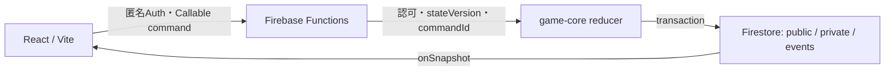

# エクストリーム花札

A solo-built, two-player real-time Hanafuda web game with rematches. The game rules live in a Firebase-independent TypeScript reducer, while Firebase Functions and Firestore handle validation and shared game state. Local development uses Firebase Emulator.
友達と2人で遊ぶ、HP制のリアルタイム花札Webゲームです。1試合を遊び、終了後は同じ部屋で再戦できます。React/Vite、Firebase Callable Functions v2、Firestore、匿名Authで構成し、ゲームルールはFirebase非依存の純粋TypeScript Reducerに分離しています。

ローカル構成は **Firebase本番へ一切接続せず**、固定プロジェクトID `demo-extreme-hanafuda` のEmulatorだけを使います。画面にログイン操作はありません。起動時にAuth Emulatorへ匿名サインインします。[公開版](https://hanahuda-adf91.web.app/)は2026-09-23にブラウザでロビー表示まで確認しました。本番の更新手順はCloud ShellとPowerShellの文書を参照してください。この確認だけで対戦の全経路を再検証したとは主張しません。

**Status:** 実際に2人で遊べるゲームとして運用しています。対戦終了後の再戦と感想戦も実装済みです。初期の1戦制の要件文書は [履歴](docs/history/initial_spec.md) に保管し、現行仕様とは区別しています。

## 状態の流れ



判定ロジックは `packages/game-core/src` の純粋TypeScriptに分離してテストできます。Functionsは参加者の認可と入力検証を行い、古い `stateVersion` を拒否します。`commandId` は再送の二重反映を防ぎ、Firestore Rulesはサーバー用状態の直接書き込みを制限します。画面は公開状態、本人用状態、イベントを購読します。

実画面を撮る場合の手順と掲載時の注意は [demo guide](docs/demo.md) に記載しています。現時点ではrepositoryに実画面画像はありません。

## 必要なもの

- Docker Desktop（Compose v2を含む）
- 空きポート: 5173、4000、5000、5001、8080、9099

Node.js、Java、Firebase CLI、`node_modules` をホストOSへインストールする必要はありません。Node.js 22、Java 21、Firebase CLI 14.27.0、ChromiumはDockerイメージ内だけに入ります。

## 起動

PowerShellでこのフォルダを開き、次を実行します。

```powershell
docker compose config
docker compose build
docker compose up -d
docker compose ps
```

初回の `build` はJava、Node、Chromiumを取得するため数分かかります。起動後のURL:

- ゲーム: http://localhost:5173
- Firebase Emulator UI: http://localhost:4000
- Emulator Hosting（ビルド済み確認用）: http://localhost:5000
- Firestore: `localhost:8080`
- Auth: `localhost:9099`
- Functions: `localhost:5001`

ログを見る場合:

```powershell
docker compose logs -f firebase web
```

## 友達と同じWi-Fiで遊ぶ

1. 作者PCで `ipconfig` を実行し、Wi-Fiアダプターの「IPv4 アドレス」を確認します（例: `192.168.1.23`）。
2. Windows Defender Firewallで確認が出た場合は、信頼できる **プライベートネットワークだけ** Docker Desktopの通信を許可します。
3. 友達は同じWi-Fiへ接続し、ブラウザで `http://作者PCのIPv4:5173`（例: `http://192.168.1.23:5173`）を開きます。
4. 作者が「部屋を作る」を押し、表示された6文字の招待コードを友達へ伝えます。友達は「部屋IDで参加」から入室します。
5. 2人とも「準備完了」を押し、作成者が「対局開始」を押します。

Webアプリは閲覧中のホスト名を使ってAuth/Firestore/Functions Emulatorへ接続するため、LAN接続時に追加設定は不要です。Emulatorをインターネットへ直接公開しないでください。異なるネットワークで遊ぶ場合は、将来ユーザーが明示的に許可した後にFirebase Hostingへdeployします。

## 停止・再開

停止:

```powershell
docker compose down
```

再開:

```powershell
docker compose up -d
```

Emulatorデータは `.firebase-data/` に保存されます。データも消したい場合は、Compose停止後にこのフォルダを手動で削除してください。

## テスト

通常テストはコンテナ内で実行します。

```powershell
docker compose --profile test run --rm test npm test
docker compose --profile test run --rm test npm run typecheck
docker compose --profile test run --rm test npm run lint
docker compose --profile test run --rm test npm run build
```

起動中のEmulatorに対するCallable統合テスト:

```powershell
docker compose --profile test run --rm test npm run test:emulators:live
```

起動中のWebとEmulatorに対する2ブラウザE2E:

```powershell
docker compose --profile test run --rm test npm run test:e2e
```

独立したRulesテスト（テストコンテナ自身が一時Emulatorを起動）:

```powershell
docker compose --profile test run --rm --no-deps -e FIRESTORE_EMULATOR_HOST=127.0.0.1:8080 test npm run test:rules
```

## 実装範囲

- 48枚の札、13種の役、配札不正パターンの再シャッフル
- 2人ロビー、招待コード、ready、開始、匿名Auth
- 手札・場札・同月選択・山札・取得札・役・HP・ターンの同期
- 12武将の月別戦術、覚醒、必殺、投了、時間切れ、HP/札切れ決着
- 対戦中は相手手札も公開するオープンハンド表示（山札順、seed、内部状態は非公開）
- Callableの認可、厳密入力検証、`stateVersion`、`commandId`冪等性
- deny-by-defaultのFirestore Rules
- 幅360px対応UIと2ブラウザPlaywrightシナリオ

仕様外のランキング、チャット、監視、App Check本番強制、TTL、WAF、PWAは実装していません。

このrepositoryのコードには独自コード用のLICENSEファイルを設定していません。

## 本番について

本番FirebaseプロジェクトIDは `hanahuda-adf91` です。Windows PCのPowerShellから公開する手順は[PowerShell本番公開手順](docs/PowerShell本番公開手順.md)を参照してください。`firebase deploy --project hanahuda-adf91 --only functions,firestore,hosting` は実際にHosting、Functions、Firestore Rulesへ変更を送信します。課金プラン変更・GitHubへのpush・deployは、所有者が明示的に許可した場合だけ実施します。
